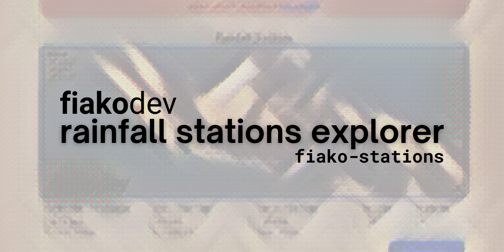
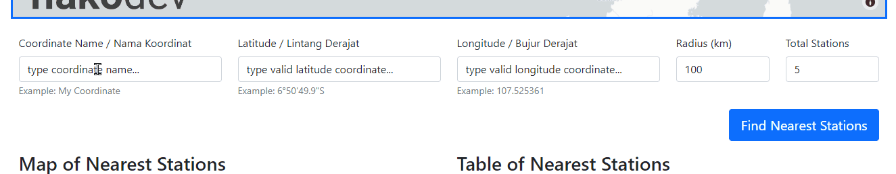
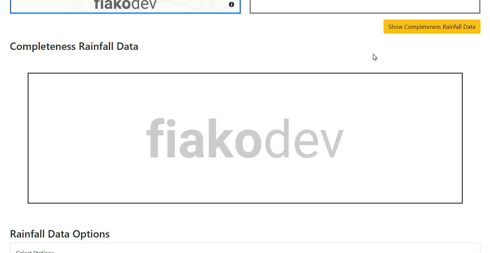
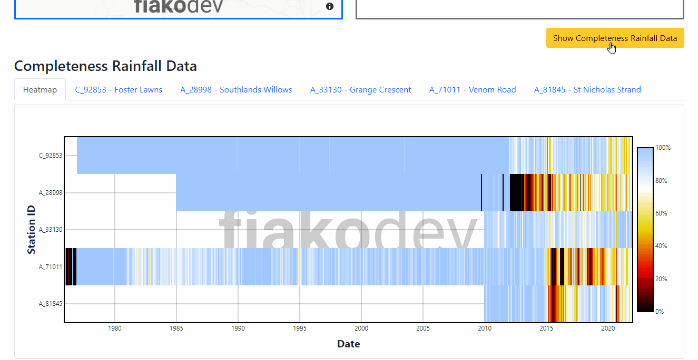
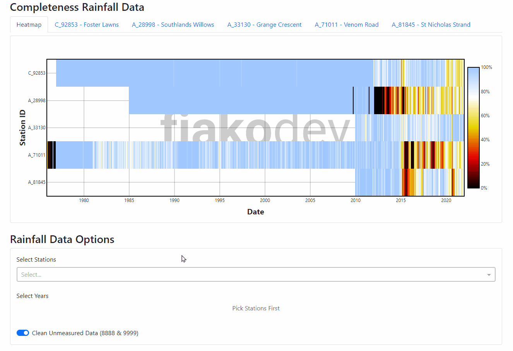
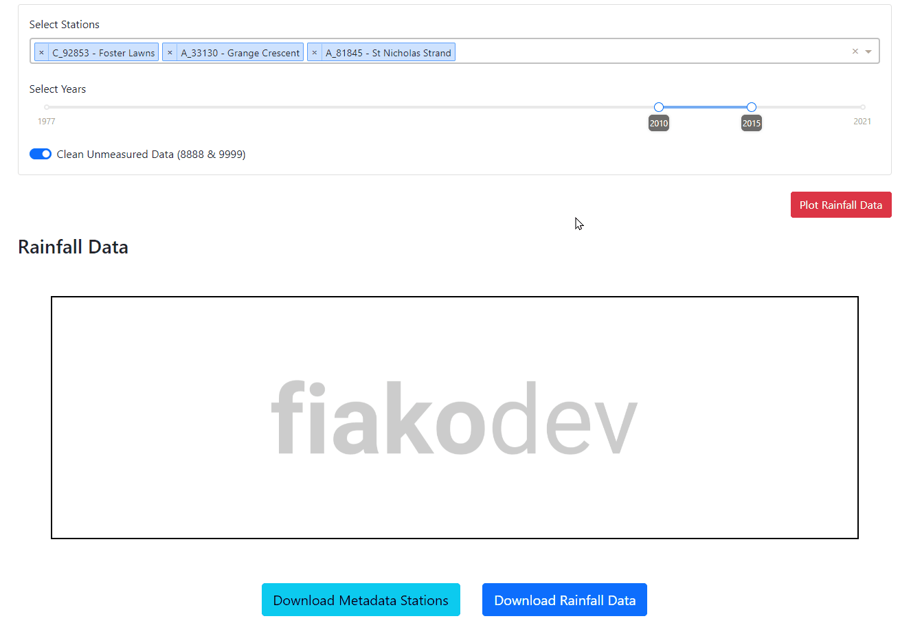
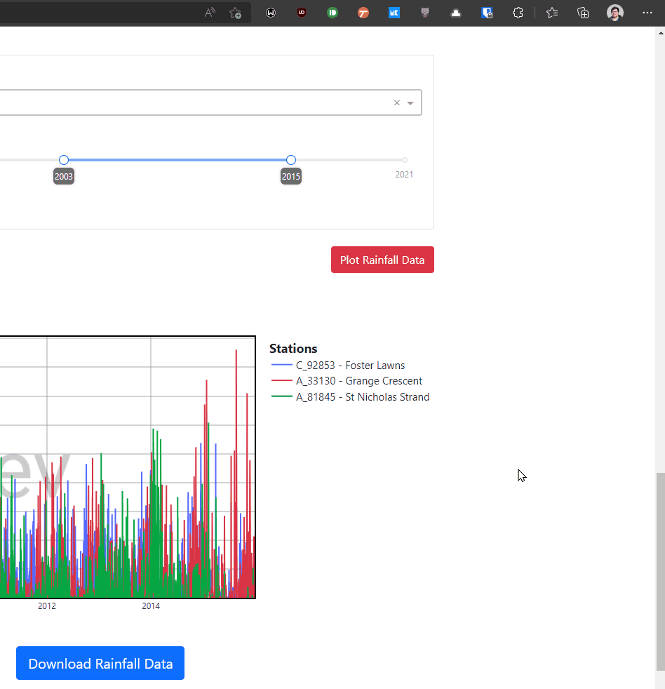

# RAINFALL STATION EXPLORER (fiako-stations)

<div align="center">
<br>


<br>

<br>

<a href="https://github.com/fiakoenjiniring/demo-stations" target="_blank"><strong>Github Repository</strong></a> // <code>fiakoenjiniring/demo-stations</code><br>
<a href="https://fiako-demo-stations.herokuapp.com" target="_blank"><strong>Aplikasi</strong></a> // <code>fiako-demo-stations.herokuapp.com</code><br>
<a href="https://youtu.be/36fYysfJSxo" target="_blank"><strong>Presentasi & Demonstrasi</strong></a>
</div>

**Rainfall Stations Explorer** atau `fiako-stations` adalah aplikasi web atau dashboard yang dapat digunakan untuk mengeksplorasi data hujan harian yang tersedia di database. Dari aplikasi ini dapat memperoleh informasi kelengkapan data dan akusisi data hujan harian dengan mudah dan cepat.

> Dataset untuk demo merupakan data acak. Lokasi stasiun hujan merupakan titik sembarang. Nama stasiun hujan dibangkitkan menggunakan [Name Generator](https://www.name-generator.org.uk/).

## FITUR APLIKASI

<div align="center">
<h3>Memudahkan eksplorasi stasiun hujan yang tersedia di database</h3>

<br>
<span align="center">Navigasi dan Interaksi Peta</span>
</div>

<div align="center">
<h3>Mengetahui informasi stasiun terdekat terhadap titik lokasi tinjauan</h3>

<br>
<span align="center">Pengisian Koordinat Titik Tinjau</span>
<br><br>

<br>
<span align="center">Interaksi Peta dan Tabel</span>
</div>

<div align="center">
<h3>Melihat secara sekilas kelengkapan data dengan heatmap</h3>

<br>
<span align="center">Navigasi dan Interaksi Heatmap</span>
<br><br>

<br>
<span align="center">Navigasi dan Interaksi Bar Plot</span>
</div>

<div align="center">
<h3>Memilih stasiun dan periode yang akan digunakan di analisis</h3>

<br>
<span align="center">Navigasi Memilih Stasiun</span>
</div>

<div align="center">
<h3>Visualisasi & Download data hujan harian dengan periode yang telah dipilih</h3>

<br>
<span align="center">Navigasi dan Interaksi Visualisasi</span>
<br><br>

<br>
<span align="center">Download Data Hujan Harian</span>
<br><br>

<br>
<span align="center">Isi File CSV</span>
</div>

## KEKURANGAN

Berikut daftar kekurangan atau _known issues_ aplikasi ini:

- Penentuan data stasiun hujan terdekat masih berdasarkan radius dari titik tinjaun. Seharusnya berdasarkan DAS dari outlet/titik tinjauan.
- Proses pembuatan dataset/database masih bersifat case-by-case. 

## TATA CARA PENGGUNAAN / TUTORIAL

Tutorial bisa di lihat pada dokumen [TUTORIAL.md](./docs/TUTORIAL.md).

## DOKUMENTASI

Berikut daftar dokumentasi yang tersedia terkait proyek ini:

- Dokumen Struktur Proyek. [Link](./docs/project_structure.md).
- Dokumen Panduan Membuat Database. [Link](./docs/create_database.md).
- Dokumen Memperbarui situs/proyek. [Link](./docs/update_project.md).
- Dokumen Tutorial/Penggunaan aplikasi. [Link](./docs/TUTORIAL.md).

## LISENSI

[MIT LICENSE](./LICENSE)

```
Copyright ©️ 2022 PT. FIAKO ENJINIRING INDONESIA

Permission is hereby granted, free of charge, to any person obtaining a copy
of this software and associated documentation files (the "Software"), to deal
in the Software without restriction, including without limitation the rights
to use, copy, modify, merge, publish, distribute, sublicense, and/or sell
copies of the Software, and to permit persons to whom the Software is
furnished to do so, subject to the following conditions:

The above copyright notice and this permission notice shall be included in all
copies or substantial portions of the Software.

THE SOFTWARE IS PROVIDED "AS IS", WITHOUT WARRANTY OF ANY KIND, EXPRESS OR
IMPLIED, INCLUDING BUT NOT LIMITED TO THE WARRANTIES OF MERCHANTABILITY,
FITNESS FOR A PARTICULAR PURPOSE AND NONINFRINGEMENT. IN NO EVENT SHALL THE
AUTHORS OR COPYRIGHT HOLDERS BE LIABLE FOR ANY CLAIM, DAMAGES OR OTHER
LIABILITY, WHETHER IN AN ACTION OF CONTRACT, TORT OR OTHERWISE, ARISING FROM,
OUT OF OR IN CONNECTION WITH THE SOFTWARE OR THE USE OR OTHER DEALINGS IN THE
SOFTWARE.
```
